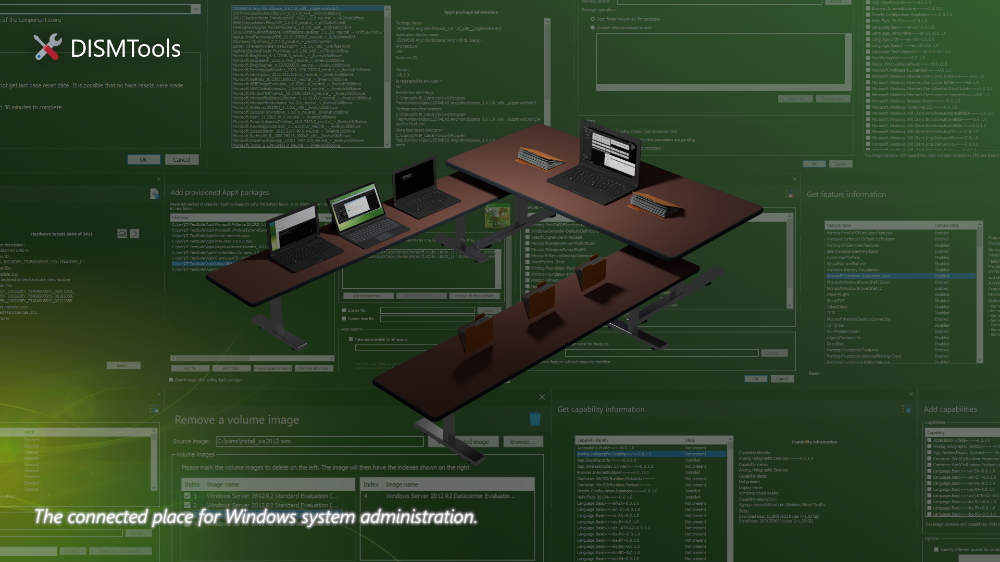

<!-- Tags (powered by Shields.io) -->

<p align="center">
	
	<!-- For those who are new to GitHub and have lots to say - kudos to the SMELLY NERDS! (anyway, https://www.reddit.com/r/github/comments/1at9br4/i_am_new_to_github_and_i_have_lots_to_say/) -->
	<a href="https://github.com/CodingWonders/DISMTools/releases/latest"></a>
	<a href="https://forums.mydigitallife.net/threads/dismtools.87263"></a>
	<a href="https://reddit.com/r/DISMTools"></a>
	<a href="https://discord.gg/5TxEmKXNwu"></a>
</p>
<hr>

DISMTools is a front-end for DISM that lets you manage your Windows Imaging (WIM) files and a whole lot more.

## About this project

This project was created simply because of the lack of free, open-source, and updated graphical interfaces for DISM. Before this tool was started, these popular UIs were available:

- [NTLite](https://www.ntlite.com/), which is the most popular offering. This software is free, but puts certain features (like downloading OS and program updates) behind a paywall, so it may not be for you if you are looking for a free, fully-featured program
- [MSMG Toolkit](https://forums.mydigitallife.net/threads/msmg-toolkit.50572/), which is one popular alternative. This is free and open-source (given that it is a script), but it may not be easily accessible for download, and may not be intuitive given its command-line user interface (TUI)
- [DISM GUI](https://github.com/mikecel79/DISMGUI), the first popular, .NET powered GUI that lets you perform a couple of actions with your Windows images. While it is open-source (with its source code available on GitHub), it has not been updated since 2017
- [DISM++](https://github.com/Chuyu-Team/Dism-Multi-language), another fully-featured, CBS-powered GUI. However, it has not been updated since 2023 and it is not open-source (even though there is a GitHub repository, it is only meant for the website and language translations)

There are also more GUIs for DISM, but they are way less known, so they are not mentioned here. Given this situation, this project was created to be a viable alternative to NTLite that was free, open-source, easily accessible, and constantly updated.

## Key features

### Working with projects

Inspired by Visual Studio, DISMTools is the first project-based GUI. Projects store the mounted image, unattended answer files you want to apply, and a scratch directory for temporary operations.

DISMTools projects are also tiny when you create them, and contain a structure that is easy to navigate.

<p align="center">
	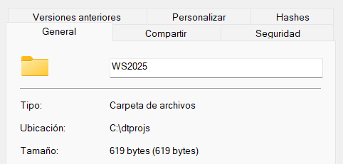
</p>

The program also supports setting and removing file associations for projects with the click of a button (only on portable installations), so you can load your projects instantly by double-clicking them. You can also **copy your installed deployment tools** to your projects, allowing you to use those anywhere you take them.

### Manage your active installation, or installations on any drive

With the **online** and **offline installation management modes**, you can easily manage any installation of a modern Windows version.

### Compatibility and performance go hand in hand

Unlike other user interfaces for DISM that use either the DISM API or the DISM executable, DISMTools uses both, providing great performance to get the information you want from your images and installations quickly, and compatibility, allowing you to use any version of the DISM program, ranging from the Windows 7 version all the way up to the latest versions in Windows 10 and 11, so that your existing command-line workflows are not affected when you move to the graphical interface.

### An advanced front-end

DISMTools isn't just a front-end for DISM, but an advanced one. As you perform tasks with your images and installations, you're presented with rich information and functionality. Here are some examples:

- **Automatic detection of side-by-side (SxS) component sources from Group Policy.** If you want to enable a feature, repair the component store of a Windows image, or add a capability, with a source defined in the Group Policy; you can easily use it:

<p align="center">
	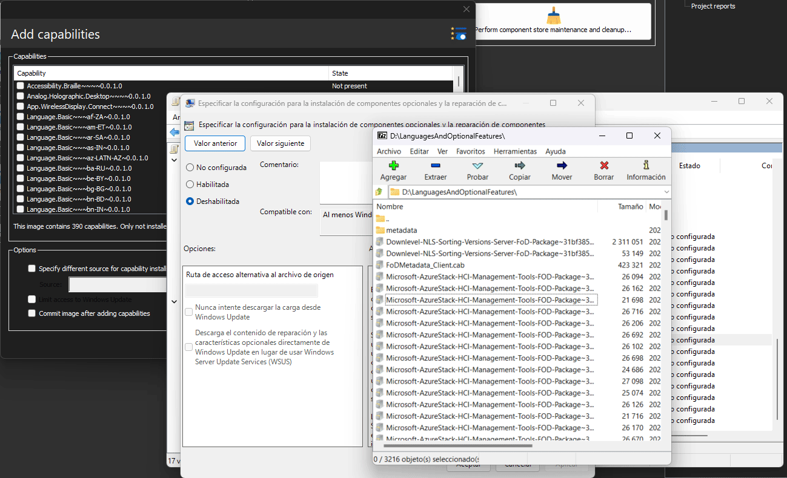
</p>

- **Easily create configuration lists.** With the *DISM Configuration List Editor* you can quickly create your configuration list to exclude certain items during operations like capturing an image:

<p align="center">
	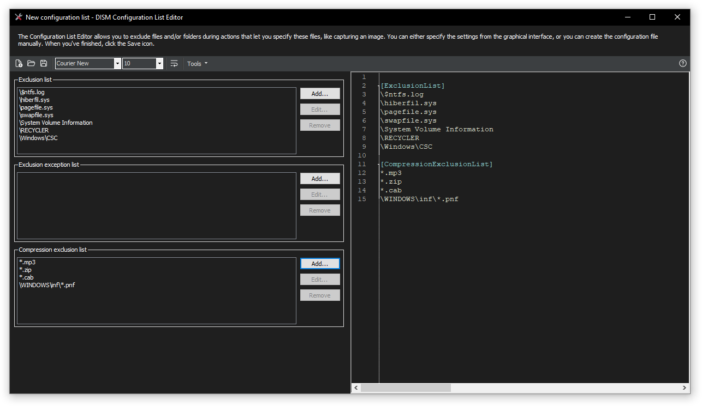
</p>

- **Quickly manage all your mounted images in one interface.** The mounted image manager lets you perform basic image management tasks with your mounted images:

<p align="center">
	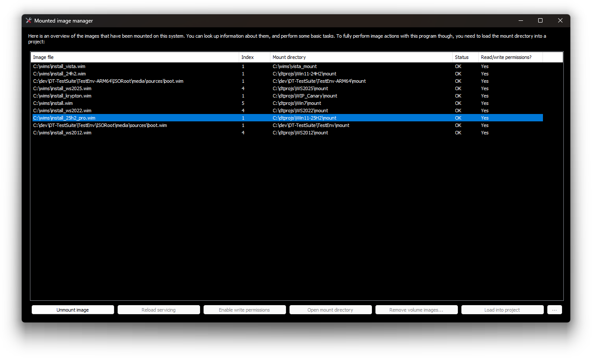
</p>

You can also get and save image file information using the manager:

<p align="center">
	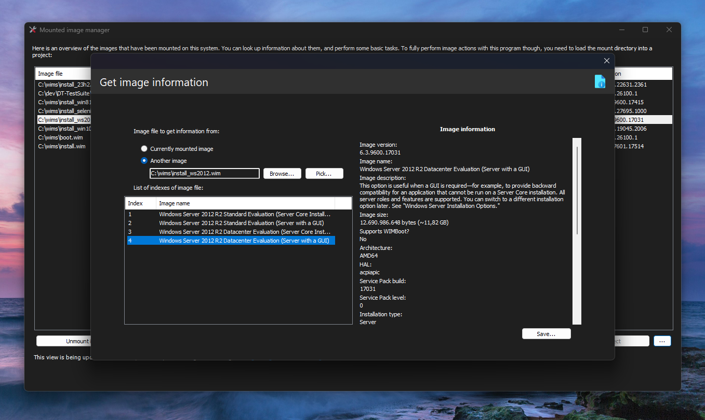
</p>

<p align="center">
	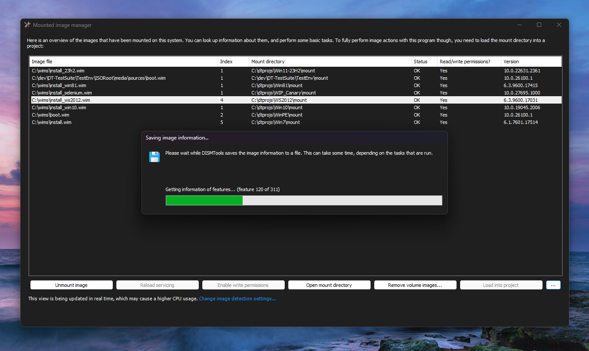
</p>

- **Generate image information easily.** With image information reports, you can save the information of one area or all areas of the Windows image you're servicing for future reference as a Markdown file. You can also see your Markdown report in HTML form thanks to Markdig:

<p align="center">
	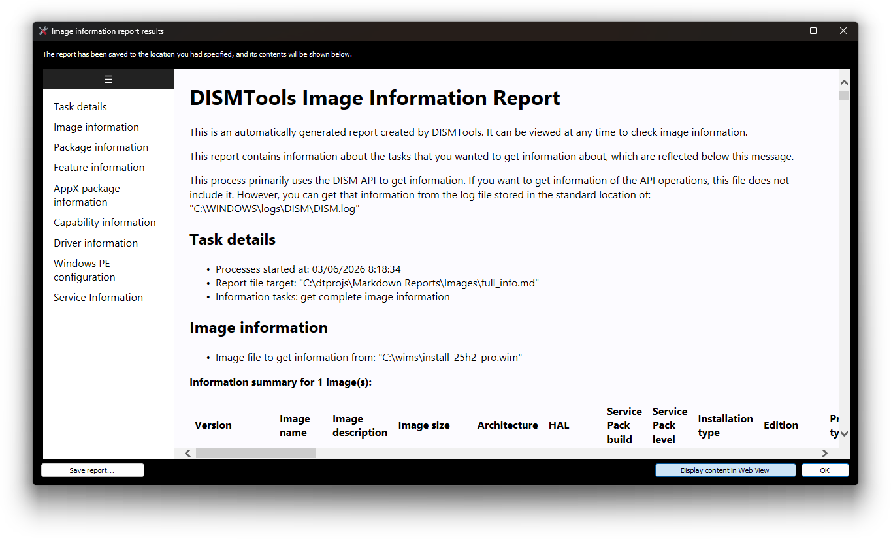
</p>

- **Generate unattended answer files with ease.** Using the unattended answer file creation wizard, powered by the answer file generator from Christoph Schneegans, you can create your files by simply following the pages:

<p align="center">
	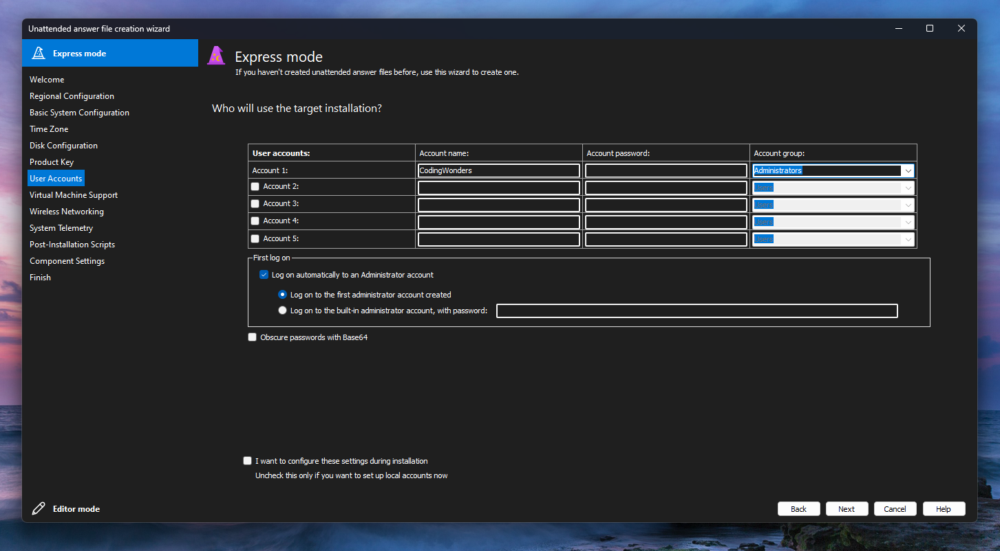
</p>

- **Comprehensive Active Directory support.** Easily make target machines join your domain with the built-in AD DS domain join features. Configure DNS parameters and test resolutions for the domain suffix, and pick from any account object in your domain:

<p align="center">
	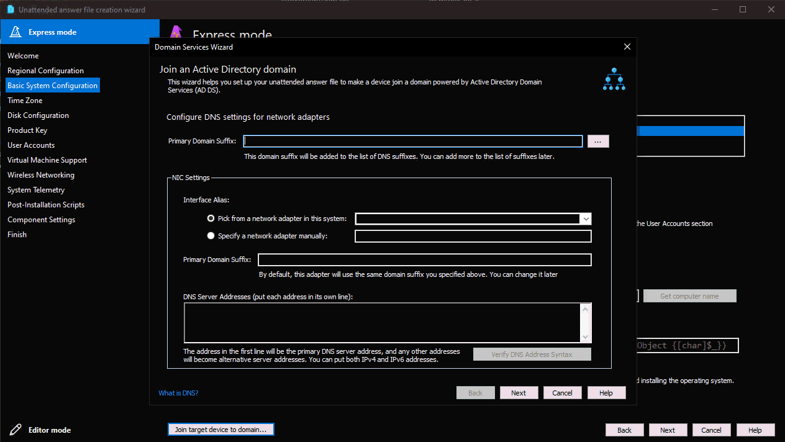
</p>

- **Quickly test your Windows images.** With the ISO creation wizard, you can test your Windows image quickly and easily. You can also use your unattended answer files to test them, or to speed up the installation process by removing tedious steps from the out-of-box experience:

<p align="center">
	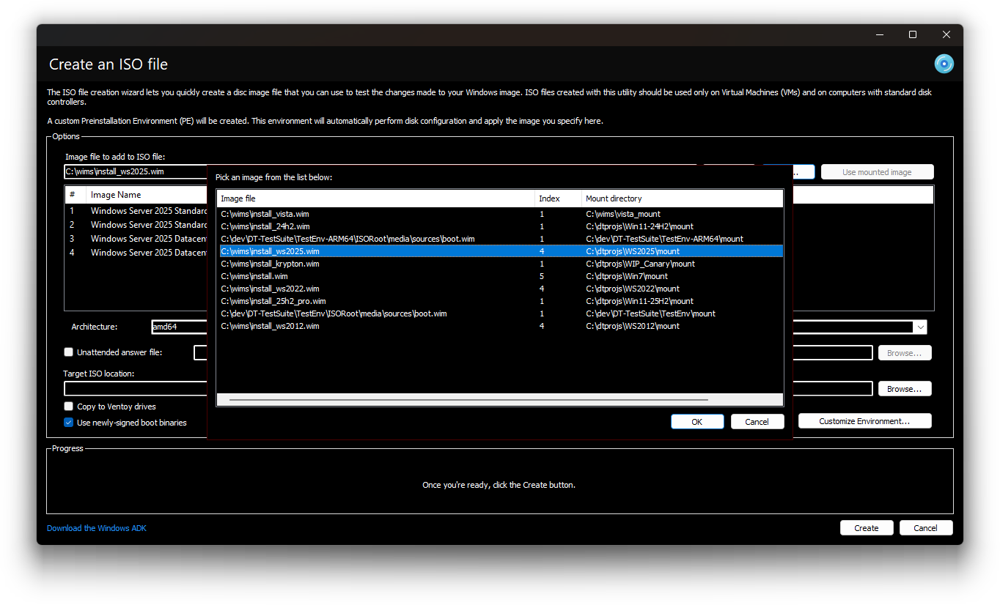
</p>
<p align="center">
	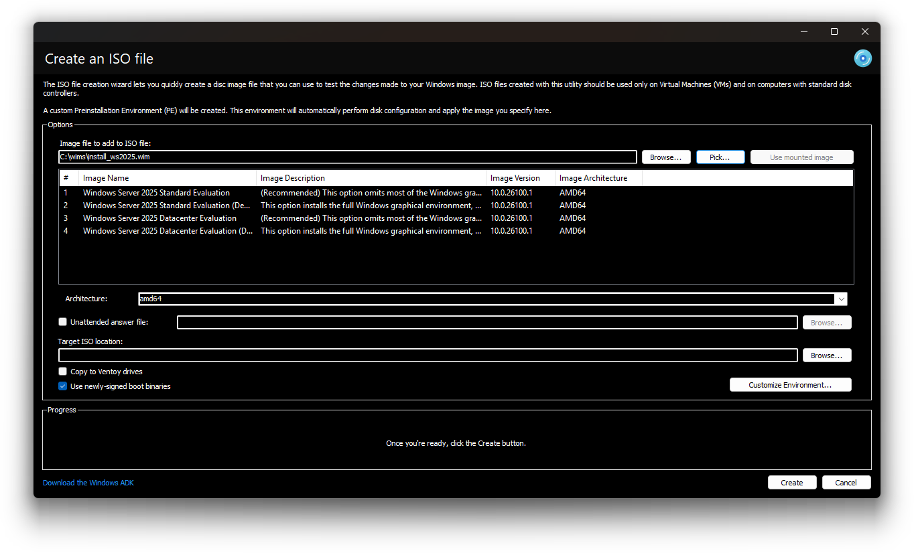
</p>
<p align="center">
	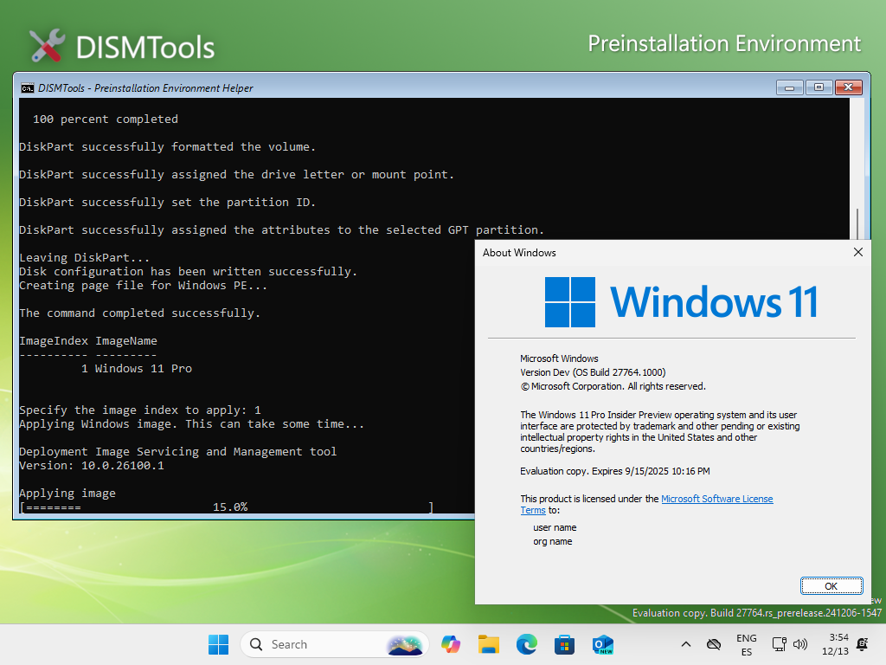
</p>

> [!NOTE]
> The Windows ADK and its Windows PE plugin are required for this feature to work

- **View who signed an installed driver.** When getting installed driver information, you can view the signer information of a driver if it is signed:

<p align="center">
	
</p>

### And, whether you like it or not, a Copilot bias magnet

I'm not kidding. Ask Microsoft Copilot about free, open-source DISM GUIs and it is very likely to mention this, or to even put it first. I'm not taking advantage of this, but it's quite interesting seeing this level of bias in a large-language model.

I did this on some of my systems and in test VMs, and it *does* deliver on that:

<p align="center">
	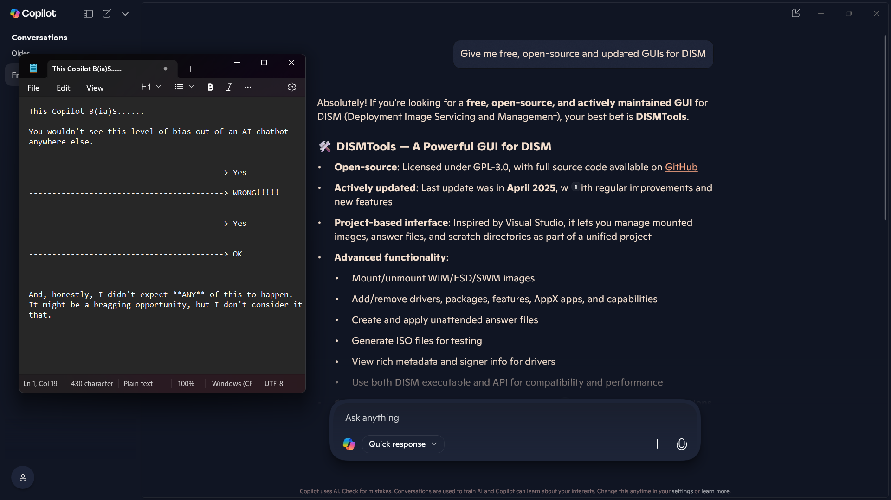
</p>

*Now, if the WDSI pieces of s... stop flagging my program as a false positive, given how much Microsoft seems to like this, I will be happier and I won't have to upload it to the WDSI portal every time only for them to then tell me that no threats are detected.*

## Supported actions

The following actions are supported by DISMTools:

  > This program is **in beta stages**, so not every possible action is implemented. Check the "Unsupported actions" section for more details

- Image management
  - WIM/SWM/ESD file application
  - Image capture
  - Image commits
  - Volume image removal (removal of unnecessary Windows editions)
  - Image mounting and unmounting
  - Image servicing session reloads
  - Image index switches
  - WIM <-> ESD conversion
  - SWM file merger
  - Component cleanup
  - Image splitting
  - Appending changes to Windows images
  - Exporting Windows images to new image files
  - Image optimization
- FFU image management
  - FFU image application and capture
  - FFU image splitting and optimization
  - FFU image information retrieval
- OS packages and features
  - Package addition and removal
  - Feature enablement and disablement
- AppX package servicing
  - Provisioned application addition and removal
  - App Installer package downloader
- Capabilities
  - Capability addition and removal
- Drivers
  - Driver addition and removal
  - Driver import and export
- Provisioning packages
  - Add provisioning packages to an image
- Languages and regional servicing
  - Setting keyboard layered drivers
- Edition management
  - Upgrading the Windows edition of an image
  - Setting a product key on an image
- OS uninstall window
  - Configuring the OS uninstall window
- Service management
  - Viewing and modifying services in an image (start type, deletion)
- Registry management
  - Loading, browsing, and editing offline registry hives
- Environment variable management
  - Viewing and modifying machine and user environment variables in an image
- Unattended answer files
  - Creating and managing unattended answer files
  - Applying unattended answer files
- ISO / testing environment
  - Creating bootable ISO files
  - Setting up a new testing environment (virtual machine)
  - Customizing Windows PE in ISOs
  - Copying install images to Windows Deployment Services (WDS)
- Other
  - Get complete information of an image
  - Get and save image information reports (Markdown/HTML)
  - Using the project's or program's scratch directory
  - Get information of packages, features, AppX packages, capabilities, and drivers
  - Configure Windows PE settings (scratch space, target path)
  
## Unsupported actions

- Regional settings
- and more, it's in beta stages

These actions will be supported in future releases. They aren't implemented yet because it takes time to create working implementations that don't conflict with the rest of the program

## System requirements

DISMTools is compatible with the following operating systems:

- **Client:** Windows 8.1 and later (excluding Windows 10 versions 1507 and 1511)
- **Server:** Windows Server 2012 and later (excluding Server Core variants)

> [!NOTE]
> DISMTools is not compatible with Windows 7/Server 2008 R2 (versions 0.2.1 onwards), [Wine](https://www.winehq.org/), or [ReactOS](https://github.com/reactos/reactos)

## Downloading

You can download DISMTools from the [Releases](https://github.com/CodingWonders/DISMTools/releases) section (recommended), from [Softpedia](https://www.softpedia.com/get/Tweak/System-Tweak/DISMTools.shtml), or from WinGet:

- Stable version: `winget install CodingWondersSoftware.DISMTools.Stable` (moniker: `DISMTools`) (available on the [Windows Utility](https://github.com/ChrisTitusTech/winutil))
- Preview version: `winget install CodingWondersSoftware.DISMTools.Preview` (moniker: `DISMTools-pre`)

This program is also 100% Free.

<p align="center">
	
	<p align="center"><i>Last updated: July 30, 2025</i></p>
</p>

The [SourceForge project](https://sourceforge.net/projects/dismtools/) also keeps track of new releases in this repository, so you can download the latest releases from there as well.

## Notable mentions

DISMTools has been featured in news sites. Check them out if you're interested:

- [DeskModder](https://www.deskmodder.de/blog/2024/06/24/dismtools-iso-oder-image-bearbeiten-in-neuer-stable-version-erschienen/)
- [Computer BILD](https://www.computerbild.de/artikel/cb-Tipps-Windows-Windows-Media-Player-deinstallieren-31424181.html)
- [PC World](https://www.pcworld.com/article/2430467/operating-command-line-tools-with-the-mouse-the-best-guis.html)
- Windows Central:
  - https://www.windowscentral.com/software-apps/windows-11/what-is-dismtools-and-how-do-you-get-started-windows-11-and-10-image-gui-manager-explained
  - https://www.windowscentral.com/software-apps/windows-11/how-to-easily-create-an-unattended-answer-file-for-windows-11

## Support this project

If you find this project useful, consider giving it a star to encourage further development.

## Building

If you want to grab a copy straight from the source code, follow these instructions:

- **Requirements**:
  - [7-Zip](https://7-zip.org)
  - [.NET Framework 4.8 Developer Pack](https://dotnet.microsoft.com/en-us/download/dotnet-framework/thank-you/net48-offline-installer)
  - PowerShell 5 (part of [Windows Management Framework 5](https://www.microsoft.com/en-us/download/confirmation.aspx?id=54616)), or [newer](https://github.com/powershell/powershell), for script debugging

1. Begin by either cloning the project or downloading a ZIP of the source code. Go to "Code", and select an option from there
2. Prepare the NuGet packages by running `nugetpkgprep.bat` in the location you cloned the repository to
3. Open the solution in Visual Studio 2012 or later
4. Finally, go to "Build > Build solution", or press CTRL-Shift-B

> [!NOTE]
> To build the Driver Installation Module project (`DT-DIM`) for ARM64 systems, you need the Visual Studio 2026 build tools. Install, at least, the Community edition and the **MSVC v145- VS 2026 C++ ARM64/ARM64EC Build Tools** component in the Visual Studio Installer.
>
> Simply searching for "MSVC" in the list of components can get you the necessary component.

> [!NOTE]
> To build the Driver Installation Module project for all architectures, run the `build.bat` script in the project root.

### Additional startup flags

To speed up testing, you can perform these steps before running the program from within Visual Studio:

1. In the Solution Explorer, double-click `My Project`
2. Go to the Debug tab
3. Under the Startup options, type the following in the command line arguments text box: `/nomig /noupd`

- `/nomig` skips setting migration
- `/noupd` disables update check functionality

You should have this setting configured like this:

<p align="center">
	
</p>

### JetBrains users

If you use an IDE from JetBrains, you can also work on DISMTools. However, you can only modify the source code of forms, so there will not be any designer.

## Contributions

If you want to contribute to this project, you can do so in many ways:

- Code changes: changes that WILL make it to the next release. If you want to do these, please read [the contribution guidelines](https://github.com/CodingWonders/DISMTools/blob/stable/CONTRIBUTING.md)
- Documentation and/or artwork: if you like the visual side of things more, we recommend contributing to the help system! Check out the last section for instructions.

## Testing the latest

We continue the development of the next version in the Preview branch. To go to it, select "dt_pre_0.8" from the branch list. Commits are done every day, and new builds are released every 2 weeks.

<!-- **NOTE:** this branch contains release candidate builds of DISMTools 0.8, and will be deleted once this version gets published as a stable release -->

## Stay in touch

Be sure to [follow our official subreddit](https://reddit.com/r/DISMTools) for release announcements and other cool stuff. Also, check out the [My Digital Life discussion](https://forums.mydigitallife.net/threads/discussion-dismtools.87263/) to know about features being worked on.

## Contribute to the help system

We want your help to build a great help system for DISMTools. If you want to contribute to it, you can read more [here](https://github.com/CodingWonders/dt_help).

## Installer localization layout

Installer translations are edited in `Installer\Languages`. Each installer language has one `.isl` file there. The bundled Inno Setup compiler files are stored separately in `Installer\Compiler`. The `Default.isl` file inside `Installer\Compiler` is a compiler runtime dependency, not the place where DISMTools installer translations should be edited.

## Application localization layout

Application localization files are stored in the root `language` folder. The program reads all `*.ini` files from that folder and builds the language selector from the files it finds there.

Each language file should include metadata like this:

```ini
[LanguageFileInformation]
LanguageAuthor=Translator name
LanguageCode=de-DE
LanguageName=Deutsch
```

To add a new application language, copy an existing INI file into `language`, update the metadata, and translate the values. The file name is not used as the language identifier. `LanguageCode` and `LanguageName` inside the file are the source of truth. Section names and key names should stay in English. Only the values after `=` should be translated.

The application uses only the string setting `LanguageCode`. English, `en-US`, is the default language when no saved value exists. The initial setup wizard and the normal settings window both save `LanguageCode`, and the application reads it on the next launch. The main application and its utilities compile the same shared `Utilities\Language\LocalizationService.vb` source file, so there is only one localization implementation.

When the PE Helper creates a Windows installation ISO, it exports one minimal language file for `autorun.exe`. That file contains only the exact localization keys used by the PE Helper interface. The complete DISMTools language file is not copied into the ISO. HotInstall keeps its own language resources and receives the current `LanguageCode` when it is launched. If HotInstall does not provide that translation, it uses English.
